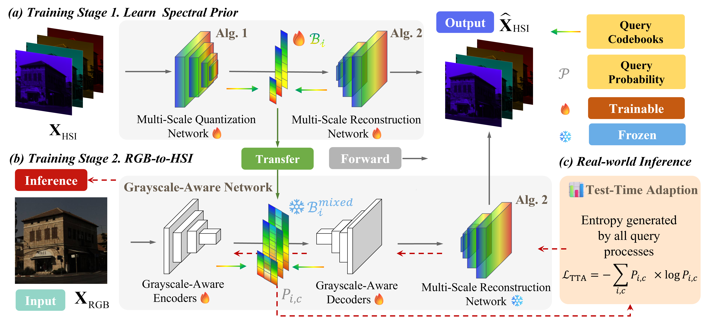
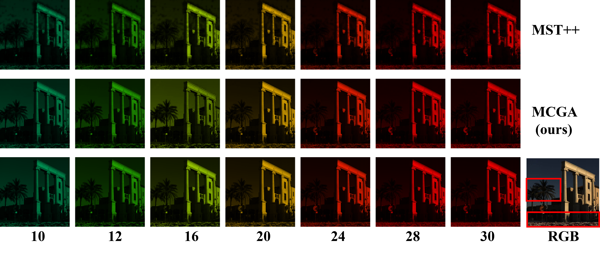

# MCGA: Hyperspectral Reconstruction via Mixture of Codebooks and Grayscale-Aware Attention
*MCGA is a deep learning algorithm used to reconstruct hyperspectral data from RGB images*

# 🚀Update

  
   
  <em>The architecture of MCGA</em>

  
   
  <em>Figure 1: Visual comparison</em>

  
   
  <em>Figure 2: Visual comparison</em>

https://github.com/user-attachments/assets/4a03f56c-1965-4236-a8fa-7feff027f102

